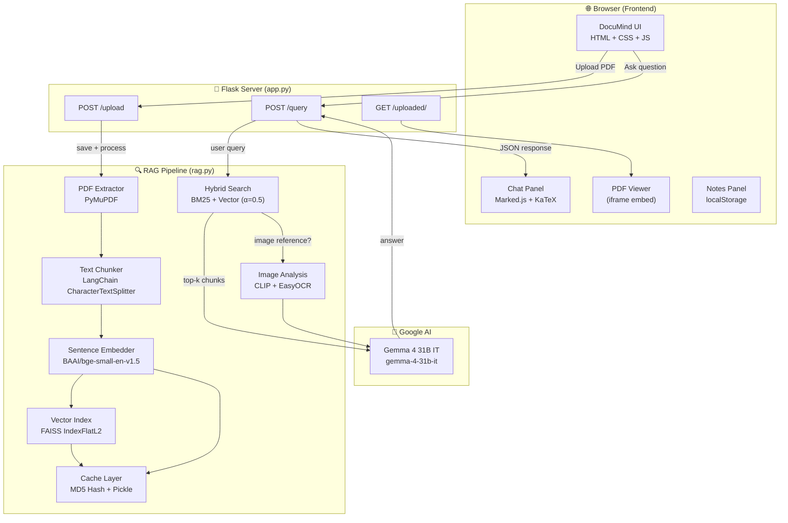
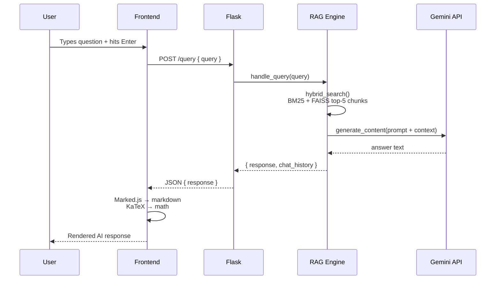
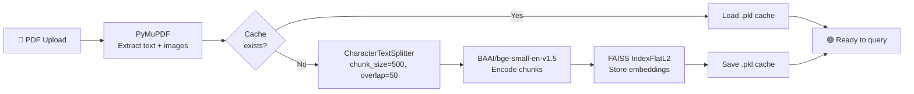

# DocuMind AI-Powered PDF Chat Assistant

<div align="center">


[](https://python.org)
[](https://flask.palletsprojects.com)
[](https://ai.google.dev)
[](https://github.com/facebookresearch/faiss)
[](LICENSE)

**Read PDFs and ask questions — without leaving the page.**

</div>

---

## 📖 What is DocuMind?

DocuMind is a **Retrieval-Augmented Generation (RAG)** web application that lets you read a PDF document on the left and chat with an AI about it on the right — all in one browser tab.

No tab-switching. No copy-pasting. Just open a document and ask.

> Upload a research paper, textbook, contract, or technical manual — then ask questions, get summaries, work through equations, or request explanations in plain language. The AI answers using only the content of your document.

### ✨ Key Features

| Feature | Details |
|---|---|
| 📄 **PDF Viewer** | Embedded side-by-side PDF reader with drag-and-drop upload |
| 🤖 **RAG Chat** | Hybrid BM25 + vector search feeds precise context to the LLM |
| 🧮 **Math Rendering** | Full KaTeX support  renders `$inline$` and `$$block$$` LaTeX |
| 📝 **Notes** | Save, edit, download any Q&A pair as a personal note |
| 🌙 **Dark / Light Mode** | Persisted theme toggle |
| ⚡ **PDF Caching** | First upload processes and caches; subsequent opens are instant |
| 🖼️ **Image OCR** | EasyOCR + CLIP for on-demand image understanding |
| 🔧 **Resizable Panes** | Drag the divider to resize the PDF and chat panels |

---

## 🏗️ System Architecture



### Data Flow Query Time



### PDF Processing Pipeline



---

## 🛠️ Tech Stack

### Backend
| Library | Role |
|---|---|
| **Flask** | Web server & REST API |
| **PyMuPDF (fitz)** | PDF text and image extraction |
| **LangChain** | `CharacterTextSplitter` for chunking |
| **sentence-transformers** | `BAAI/bge-small-en-v1.5` dense embeddings |
| **FAISS** | Approximate nearest-neighbour vector search |
| **rank-bm25** | Sparse BM25 keyword retrieval |
| **NLTK** | Tokenisation for BM25 |
| **CLIP** | Image-text similarity scoring |
| **EasyOCR** | On-demand OCR for PDF images |
| **google-genai** | Google Gemini API client (`gemma-4-31b-it`) |
| **python-dotenv** | Environment variable management |

### Frontend
| Technology | Role |
|---|---|
| **Vanilla JS** | App logic, resizer, tabs, upload, chat |
| **Marked.js** | Client-side Markdown rendering |
| **KaTeX** | LaTeX math rendering (`$...$`, `$$...$$`) |
| **DOMPurify** | XSS sanitisation of AI output |
| **CSS Custom Properties** | Design tokens for full dark/light theming |
| **Inter + JetBrains Mono** | Google Fonts typography |

---

## 🚀 Setup & Installation

### Prerequisites

| Requirement | Notes |
|---|---|
| Python 3.10+ | [python.org](https://python.org) |
| Tesseract OCR | [UB Mannheim installer](https://github.com/UB-Mannheim/tesseract/wiki) (Windows) |
| Google AI API Key | [Get one at ai.google.dev](https://ai.google.dev) |
| Git | For cloning the repo |

---

### 1. Clone the repository

```bash
git clone https://github.com/avish006/Rag-Project.git
cd Rag-Project
```

### 2. Create and activate a virtual environment

```bash
# Windows
python -m venv .venv
.venv\Scripts\activate

# macOS / Linux
python -m venv .venv
source .venv/bin/activate
```

### 3. Install dependencies

```bash
pip install -r requirements.txt
```

> ⚠️ **First install is large (~3–5 GB)** — PyTorch, CLIP, sentence-transformers, and EasyOCR models will download on first run.

### 4. Download NLTK data

```bash
python nltk_download.py
```

### 5. Configure environment variables (Optional)

Create a `.env` file in the project root:

```env
FLASK_SECRET_KEY="any-random-secret-string"
# TESSERACT_CMD="C:\\Program Files\\Tesseract-OCR\\tesseract.exe" (Windows only)
```

> 🔑 **API Keys:** You no longer need to put your Google API key in the `.env` file. The app now uses a **Bring Your Own Key (BYOK)** model. You will enter your key securely directly in the browser UI when you launch the app.
> ⚠️ **Never commit your `.env` file** — it is listed in `.gitignore`.

### 6. Run the application

```bash
python app.py
```

Then open **[http://127.0.0.1:5000](http://127.0.0.1:5000)** in your browser.

> 📝 First startup takes **15–30 seconds** — PyTorch and model weights load into memory. Subsequent restarts are faster once models are cached locally.

---

## 📁 Project Structure

```
Rag-Project/
├── app.py                  # Flask server & REST API routes
├── rag.py                  # RAG pipeline (extract, embed, retrieve, generate)
├── requirements.txt        # Python dependencies
├── nltk_download.py        # NLTK corpus downloader script
├── .env.example            # Template for environment variables
├── .gitignore
│
├── templates/
│   └── index.html          # Single-page app shell
│
├── static/
│   ├── style.css           # Full dark/light design system (CSS custom properties)
│   ├── script.js           # Frontend logic (chat, upload, resizer, notes, math)
│   └── marked.min.js       # Bundled Markdown parser
│
├── uploads/                # Uploaded PDFs (gitignored)
├── cache/                  # Pickle cache of processed PDFs (gitignored)
├── figures/                # Extracted PDF images (gitignored)
└── model_cache/            # Downloaded model weights (gitignored)
```

---

## 💡 Usage Guide

### Uploading a PDF
1. Drag and drop any PDF onto the left panel **or** click **Choose PDF**
2. Wait for the progress bar — processing time depends on PDF size
3. The PDF opens in the viewer once processing completes

### Asking Questions
- Type your question in the chat box on the right
- Press **Enter** to send, **Shift+Enter** for a new line
- Use the suggestion chips on the empty screen for quick starts

### Math in Responses
The AI can render full LaTeX math. Examples you can ask:
- *"Derive the quadratic formula"*
- *"What does this equation mean: $E = mc^2$?"*
- *"Show me the integral for the normal distribution"*

### Saving Notes
- Click **Save to Notes** on any AI response
- Give the note a name in the modal
- Switch to the **Notes** tab to view, edit, or export your notes

---

## ⚙️ Configuration

| Variable | Default | Description |
|---|---|---|
| `FLASK_SECRET_KEY` | — | Flask session secret (set in `.env`) |
| `TESSERACT_CMD` | `C:\Program Files\Tesseract-OCR\tesseract.exe` | Path to Tesseract binary |
| `MAX_CONTENT_LENGTH_MB` | `50` | Max PDF upload size |

---

## ☁️ Deployment (Hugging Face Spaces)

You can easily host this application for free on [Hugging Face Spaces](https://huggingface.co/spaces) using Docker.

> **⚠️ Important note on Deployment vs Local:**
> The `main` branch of this repository contains the **full application**, including CLIP and EasyOCR for image understanding. However, these models require ~2.7GB of RAM, which exceeds the free tier limits of most platforms (including Hugging Face Spaces' 16GB limit due to boot-time memory spiking and persistent disk limits). 
> 
> To solve this, a `huggingface/` directory is provided. It contains a "slimmed down" version of the app that removes the Image OCR/CLIP models. The text-based RAG chat works perfectly and fits within a ~300MB footprint.

### How to deploy to Hugging Face Free Tier:
1. Create a new Space on Hugging Face.
2. Choose **Docker** as the Space SDK.
3. Choose **Blank** template.
4. Upload the contents of the `huggingface/` directory (the modified `rag.py`, `app.py`, `requirements.txt`, and `Dockerfile`).
5. Copy the `templates/` and `static/` directories from the root folder into the Space as well.
6. The Space will automatically build and start the Docker container.
7. Users can visit your Space, enter their own Google API key in the UI, and chat with PDFs for free.

---

## 🔒 Security Notes

- All AI output is sanitised with **DOMPurify** before rendering to prevent XSS
- API keys are loaded from `.env` and never exposed to the frontend
- Uploaded filenames are sanitised and timestamped (`uploaded_<timestamp>.pdf`)
- PDF caching uses MD5 content hashing — not filenames

---

## 📄 License

MIT License — see [LICENSE](LICENSE) for details.

---

<div align="center">
Built with ❤️ using Flask, FAISS, and Google Gemini
</div>
